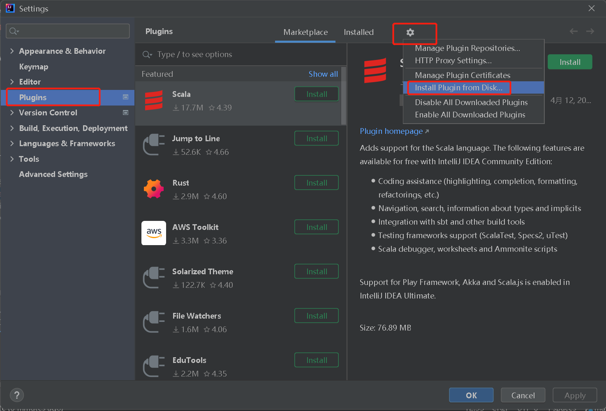

# swagger-plugin

#### 介绍
一个swagger插件，如果你已经使用了swagger，那么它可以用来帮助生成swagger api docx 文档

#### 软件架构
软件架构说明

#### 安装教程

1.  [下载](https://gitee.com/xianbingwei/swagger-plugin/blob/master/swagger-helper.zip)
2.  安装

3. 重启idea
#### 使用说明

1.  选中你需要生成api docx的目录
2.  点击生成

3.  生成结果，（idea里面可能不会实时显示，建议直接去本地目录下看）

#### 参与贡献

1.  Fork 本仓库
2.  新建 Feat_xxx 分支
3.  提交代码
4.  新建 Pull Request

