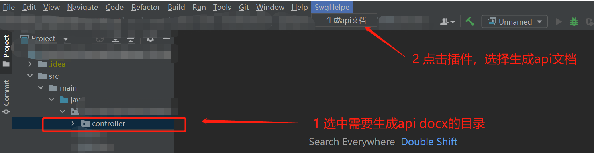

# swagger-plugin

#### 介绍
{**以下是 Gitee 平台说明，您可以替换此简介**
Gitee 是 OSCHINA 推出的基于 Git 的代码托管平台（同时支持 SVN）。专为开发者提供稳定、高效、安全的云端软件开发协作平台
无论是个人、团队、或是企业，都能够用 Gitee 实现代码托管、项目管理、协作开发。企业项目请看 [https://gitee.com/enterprises](https://gitee.com/enterprises)}

#### 软件架构
软件架构说明

#### 安装教程

1.  [下载](http://https://gitee.com/xianbingwei/swagger-plugin/releases/api%E7%94%9F%E6%88%90%E5%B7%A5%E5%85%B71.0%E7%89%88)
2.  安装

#### 使用说明

1.  选中你需要生成api docx的目录
2.  点击生成

#### 参与贡献

1.  Fork 本仓库
2.  新建 Feat_xxx 分支
3.  提交代码
4.  新建 Pull Request

